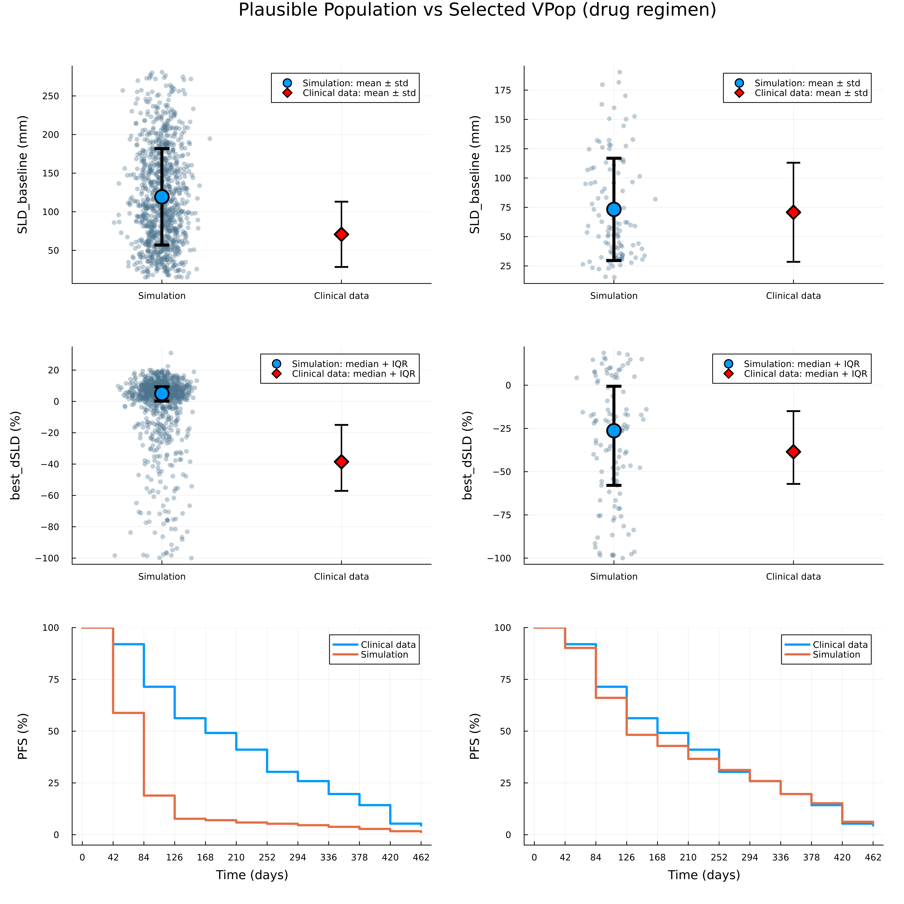

# Tutorial

A non-small cell lung cancer (NSCLC) model [2] is used to demonstrate the VPopMIP approach. A set of 1000 plausible patients was generated using scripts provided in the supplementary materials of [2].
In the original study, individual patient data were used for VPop selection, including three endpoints for 112 patients across two treatment regimens (“drug” and “placebo”). To demonstrate applicability of the proposed method to more realistic settings, we converted individual-level data into summary statistics:
- SLD_baseline: mean and std of baseline tumor size (sum of longest diameters)
- best_dSLD: 25th, 50th, 75th percentiles of the best percentage change in SLD
- PFS: progression free survival data

First, we load the simulated plausible population and use the `load_vpop` function to select the columns in the plausible patient table that correspond to clinically reported endpoints.

```julia
using VPopMIP, CSV, DataFrames, Plots, StatsBase, StatsPlots

ppopdf = CSV.read("../../../models/Braniff2024/ppopdf1000.csv", DataFrame)
ppop = load_vpop(ppopdf1000; endpoints=["best_dSLD", "time_to_best", "time_to_pfs", "SLD_baseline"])
```

Next, we load clinical data (individual patient data for the *drug* and *placebo* regimens) and convert it into summary statistics using predefined metrics available in [DigiPopData](https://hetalang.github.io/DigiPopData.jl/dev/), to represent a more realistic scenario.

```julia
# Experimental cohort
exp_placebo = CSV.read("../../../models/Braniff2024/synthetic_cohort_placebo.csv", DataFrame)
exp_drug = CSV.read("../../../models/Braniff2024/synthetic_cohort_drug.csv", DataFrame)
expdf = vcat(exp_placebo, exp_drug)

# size of cohort (assuming the same for drug and placebo)
drug_cohort_size = nrow(exp_placebo)

# SLD baseline mean/sd
sld_baseline_placebo = MeanSDMetric(drug_cohort_size, mean(exp_placebo.SLD_baseline), std(exp_placebo.SLD_baseline))
sld_baseline_drug = MeanSDMetric(drug_cohort_size, mean(exp_drug.SLD_baseline), std(exp_drug.SLD_baseline))

# SLD median/minmax
best_sld_placebo = QuantileMetric(drug_cohort_size, [0.25, 0.5, 0.75], quantile(exp_placebo.best_dSLD, [0.25, 0.5, 0.75]))
best_sld_drug = QuantileMetric(drug_cohort_size, [0.25, 0.5, 0.75], quantile(exp_drug.best_dSLD, [0.25, 0.5, 0.75]))

# PFS
weeks = [0, 6, 12, 18, 24, 30, 36, 42, 48, 54, 60, 66]
cutoffs = 7.0 .* weeks  # days

# make sure we ignore missing and only count real progression/exit days
#counts = [count(x -> !ismissing(x) && x <= c, expdf.EEVALUMP) for c in cutoffs]
survival_counts_placebo = [count(x -> !ismissing(x) && x <= c, exp_placebo.time_to_pfs) for c in cutoffs]
survival_percents_placebo = 100 .* survival_counts_placebo ./ drug_cohort_size
pfs_placebo = SurvivalMetric(drug_cohort_size, (100.0 .- survival_percents_placebo) / 100,  cutoffs)

survival_counts_drug = [count(x -> !ismissing(x) && x <= c, exp_drug.time_to_pfs) for c in cutoffs]
survival_percents_drug = 100 .* survival_counts_drug ./ drug_cohort_size
pfs_drug = SurvivalMetric(drug_cohort_size, (100.0 .- survival_percents_drug) / 100, cutoffs)
```

We use MetricBindings from DigiPopData to match experimental data with endpoint names in the plausible population table.

```julia
# SLD baseline mean/sd
sld_baseline_placebo_bind = MetricBinding("SLD_baseline", "placebo", sld_baseline_placebo, "SLD_baseline", true)
sld_baseline_drug_bind = MetricBinding("SLD_baseline", "drug", sld_baseline_drug, "SLD_baseline", true)

# SLD median/minmax
best_sld_placebo_bind = MetricBinding("Best_dSLD", "placebo", best_sld_placebo, "best_dSLD", true)
best_sld_drug_bind = MetricBinding("Best_dSLD", "drug", best_sld_drug, "best_dSLD", true)

# PFS
pfs_placebo_bind = MetricBinding("PFS_curve", "placebo", pfs_placebo, "time_to_pfs", true)
pfs_drug_bind = MetricBinding("PFS_curve", "drug", pfs_drug, "time_to_pfs", true)

data = [sld_baseline_placebo_bind, sld_baseline_drug_bind,
        best_sld_placebo_bind, best_sld_drug_bind,
        pfs_placebo_bind, pfs_drug_bind]
```

Finally, we use the `select_cohort` function to solve the binary optimization problem, resulting in an optimal subset (the VPop) that matches the clinical data. By default, `SCIP.Optimizer` is used. You can provide a custom optimizer and time/gap settings in `select_cohort(...; kwargs...)`.

```julia
vpnum = 112
vpop = select_cohort(ppop, data, vpnum; scip_limits_gap = 0.01)
```

We can also visualize the results and compare the plausible population with the selected cohort.

```julia
vpopdf = filter(:scenario => x -> x == "drug",DataFrame(vpop))
ppopdf = filter(:scenario => x -> x == "drug",DataFrame(ppop))

function SLD_base_sim_exp(
    df;
    exp_mean = mean(exp_drug.SLD_baseline),
    exp_std = std(exp_drug.SLD_baseline)
)
    sim_mean = mean(df.SLD_baseline)
    sim_std  = std(df.SLD_baseline)

    default_blue = palette(:default)[1]

    p = plot(
        xticks = ([1, 2], ["Simulation", "Clinical data"]),
        ylabel = "SLD_baseline (mm)",
        legend = :topright,
        xlims = (0.5, 2.5),
        dpi = 400
    )

    x_sim = fill(1, nrow(df)) .+ 0.08 .* randn(nrow(df))

scatter!(
    p,
    x_sim,
    df.SLD_baseline,
    color = RGB(0.3, 0.45, 0.55),  # blue-grey
    alpha = 0.35,
    markersize = 3.5,
    markerstrokewidth = 0,
    label = false
)

    scatter!(
        p,
        [1], [sim_mean],
        yerror = ([sim_std], [sim_std]),
        color = default_blue,
        markersize = 10,
        linewidth = 4,
        label = "Simulation: mean ± std"
    )

    scatter!(
        p,
        [2], [exp_mean],
        yerror = ([exp_std], [exp_std]),
        color = :red,
        markersize = 9,
        markershape = :diamond,
        linewidth = 2,
        label = "Clinical data: mean ± std"
    )

    return p
end

function dSLD_sim_exp(
    df;
    exp_q25 = quantile(exp_drug.best_dSLD, 0.25),
    exp_q50 = quantile(exp_drug.best_dSLD, 0.5),
    exp_q75 = quantile(exp_drug.best_dSLD, 0.75)
)
    sim_q25 = quantile(df.best_dSLD, 0.25)
    sim_q50 = quantile(df.best_dSLD, 0.50)
    sim_q75 = quantile(df.best_dSLD, 0.75)

    default_blue = palette(:default)[1]

    p = plot(
        xticks = ([1, 2], ["Simulation", "Clinical data"]),
        ylabel = "best_dSLD (%)",
        legend = :topright,
        xlims = (0.5, 2.5),
        dpi = 400
    )

    # --- Simulation scatter ---
    x_sim = fill(1, nrow(df)) .+ 0.08 .* randn(nrow(df))

    scatter!(
        p,
        x_sim,
        df.best_dSLD,
        color = RGB(0.3, 0.45, 0.55),  # blue-grey
    alpha = 0.35,
    markersize = 3.5,
    markerstrokewidth = 0,
    label = false
    )

    # --- Simulation median + IQR ---
    scatter!(
        p,
        [1], [sim_q50],
        yerror = ([sim_q50 - sim_q25], [sim_q75 - sim_q50]),
        color = default_blue,
        markersize = 10,
        linewidth = 4,
        label = "Simulation: median + IQR"
    )

    # --- Clinical data ---
    scatter!(
        p,
        [2], [exp_q50],
        yerror = ([exp_q50 - exp_q25], [exp_q75 - exp_q50]),
        color = :red,
        markersize = 9,
        markershape = :diamond,
        linewidth = 2,
        label = "Clinical data: median + IQR"
    )

    return p
end

p11 = SLD_base_sim_exp(ppopdf)
p12 = SLD_base_sim_exp(vpopdf)
p21 = dSLD_sim_exp(ppopdf)
p22 = dSLD_sim_exp(vpopdf)
p31 = plot(ppop, pfs_drug_bind; dpi=400, xguide="Time (days)", yguide="PFS (%)")
p32 = plot(vpop, pfs_drug_bind; dpi=400, xguide="Time (days)", yguide="PFS (%)")

p = plot(
    p11, p12,
    p21, p22,
    p31, p32,
    layout = (3, 2),
    size = (1200, 1200),
    margins=5Plots.mm, 
    plot_title = "Plausible Population vs Selected VPop (drug regimen)"
)
```
